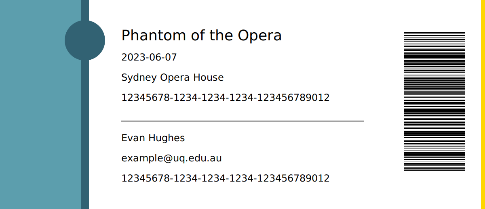
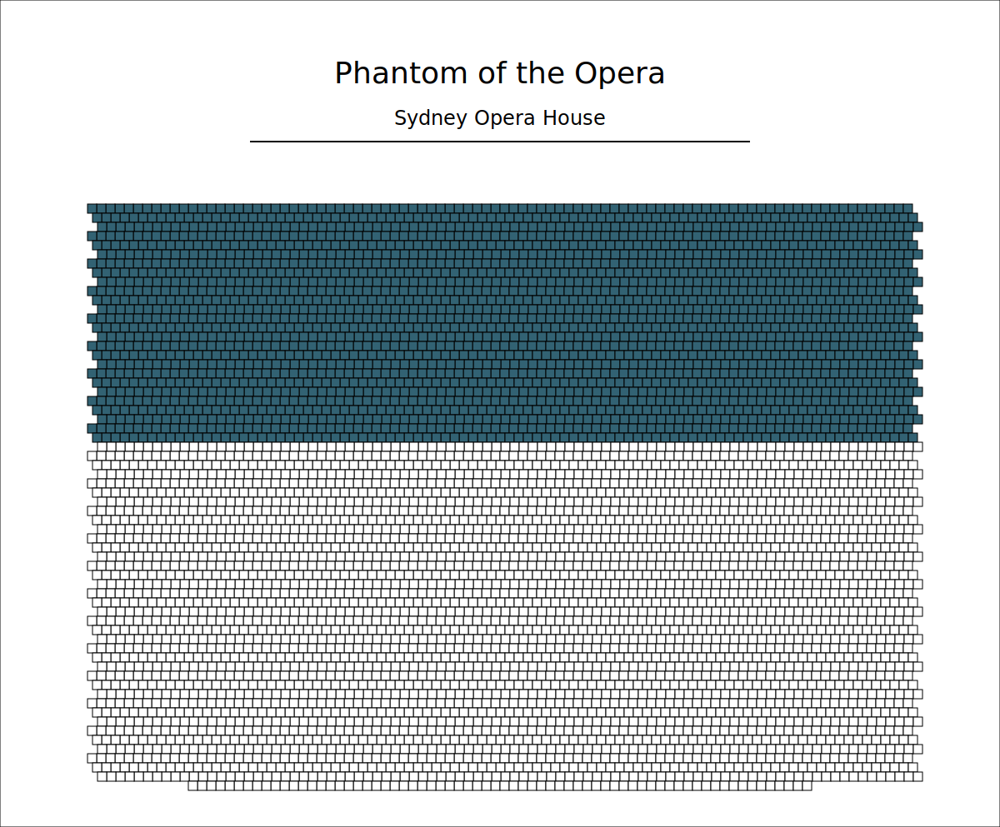
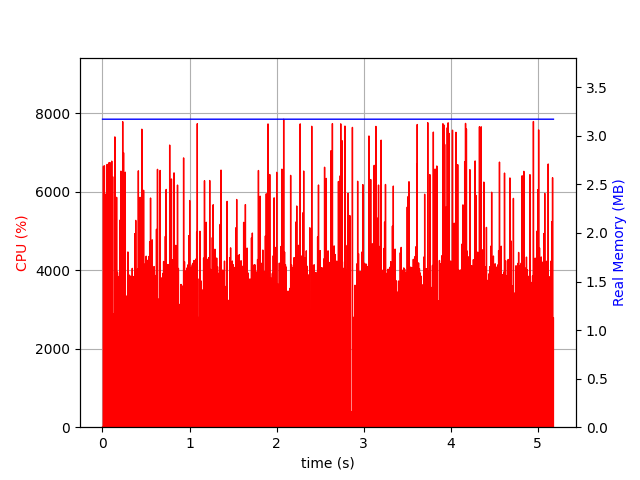
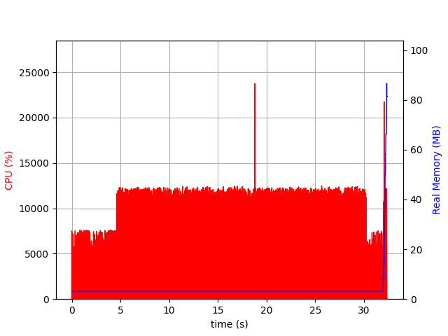

# Hamilton

A command line interface for generating ticket and concert information into rendered SVGs.

## Installation

This package must be installed by collecting the static binary given in the releases.

## Usage

#### Help

```bash
hamilton --help
```

```bash
hamilton generate ticket --help
```

```bash
hamilton generate seating --help
```


#### Generate a ticket

Tickets are generated from a JSON file like so:

```json
{
  "id": "12345678-1234-1234-1234-123456789012",
  "name": "Evan Hughes",
  "email": "example@uq.edu.au",
  "concert": {
    "id": "12345678-1234-1234-1234-123456789012",
    "name": "Phantom of the Opera",
    "date": "2023-06-07",
    "venue": "Sydney Opera House"
  }
}
```

The output is a path with a filename but no extension where a .json will be generated for errors otherwise a svg will be made.

```bash
hamilton generate ticket --input input.json --output output
```

Example:



#### Generate a concert seating plan

Seating plans are generated from a JSON file like so:

```json
{
  "id": "12345678-1234-1234-1234-123456789012",
  "name": "Phantom of the Opera",
  "date": "2023-06-07",
  "venue": "Sydney Opera House",
  "seats": {
    "max": 5738,
    "purchased": 2340
  }
}
```

The output is a path with a filename but no extension where a .json will be generated for errors otherwise a svg will be made.

```bash
hamilton generate concert --input input.json --output output
```

Example:



## Motivation

This project was created for the assessment of the subject CSSE6400 Software Architecture at the University of Queensland.
It is intended to generate an output that requires work, this version accomplishes this by computing an arbitrary BCRYPT hash which is thrown away.
The program then generates the SVGs which are of trivial computation.

## Performance Characteristics

These stats were made on a **t4g.micro** using:

```bash
psrecord "hamilton ....." --log activity.txt --plot performance.png
```


| Type                      | Stats                        |
|---------------------------|------------------------------|
| ticket                    |   |
| seating                   |  |

## Contributing

Contributions are welcome but the project is for the usage in an assessment so some aspects of the program are intentional to create load on the system.

## Changes

### 1.1.0

- Renamed the uuid fields to id to match the API

### 1.0.0

- Initial release